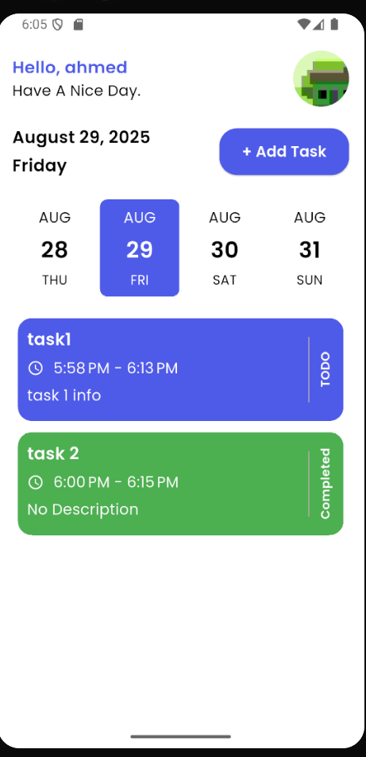
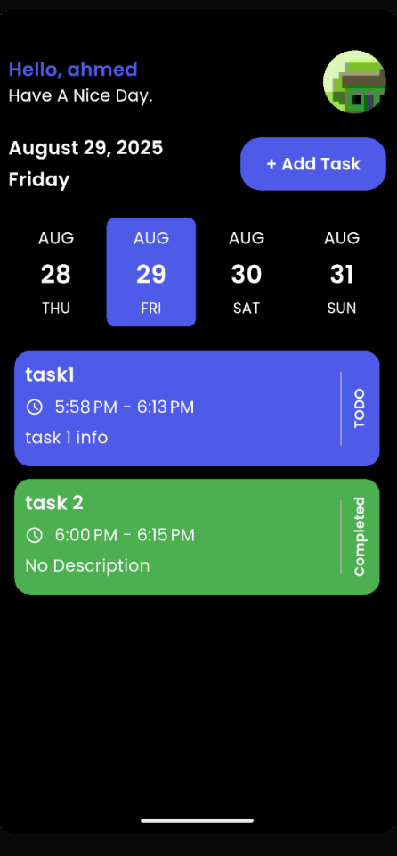
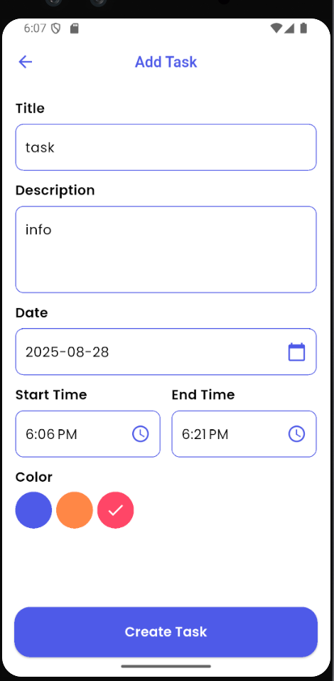
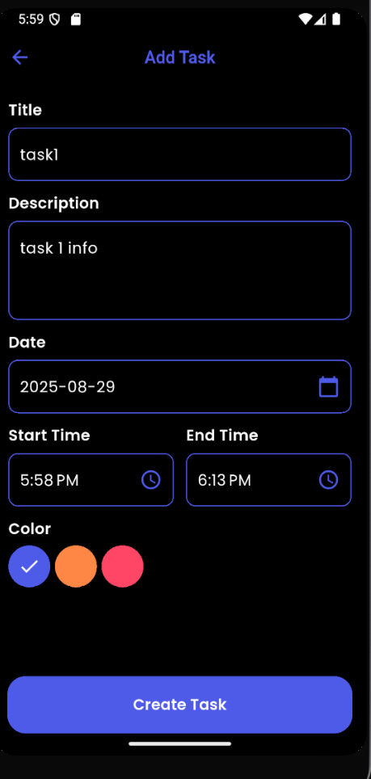
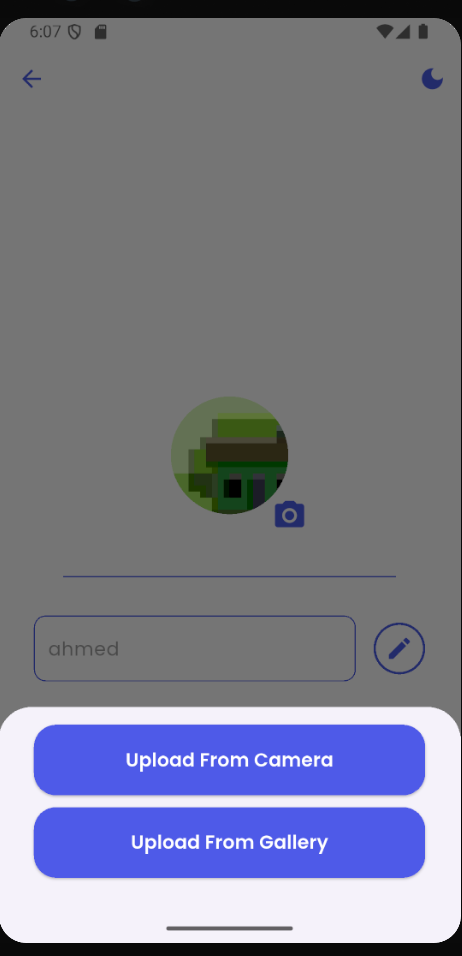
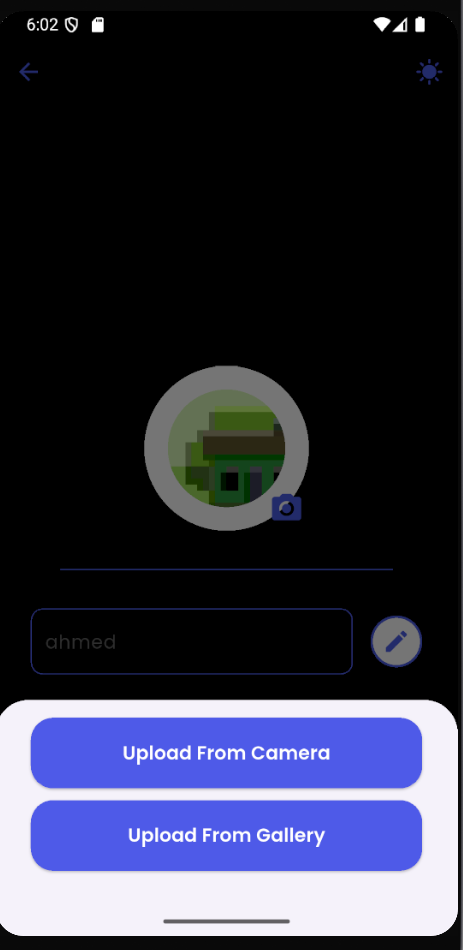

# 📅 Taskati App

Taskati is a simple and elegant **task management app** built with **Flutter**.  
It helps you organize your daily schedule, manage your tasks, and stay productive.  

---

## ✨ Features  

- 👤 **User Profile**  
  - Update your profile with your name and profile picture.  

- 📝 **Task Management**  
  - Add new tasks with title, description, and time.  
  - Edit or update existing tasks.  
  - Mark tasks as **TODO** or completed (coming soon).  

- 📆 **Calendar & Timeline**  
  - Pick dates easily with a beautiful date timeline.  
  - View all tasks for the selected day.  

- 🎨 **UI/UX**  
  - Modern and colorful interface.  
  - Responsive and clean design.  
  - Supports **Light Mode** 🌞 and **Dark Mode** 🌙  

---

## 📸 Screenshots  

### 🏠 Home Screen  
| Light Mode | Dark Mode |  
|------------|-----------|  
|  |  |  

### ➕ Add Task Screen  
| Light Mode | Dark Mode |  
|------------|-----------|  
|  |  |  

### 👤 Profile Screen  
| Light Mode | Dark Mode |  
|------------|-----------|  
|  |  |  
